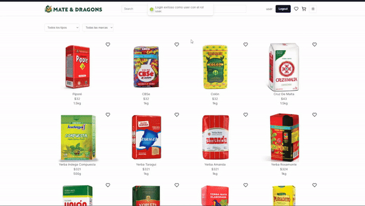

# Mate & Dragons - E-commerce Yerba Mate Platform


## Description

Mate & Dragons is an e-commerce platform designed to provide a seamless shopping experience of yerba mate for users. It features a clean and responsive interface, advanced filtering options, and integration with an API to fetch product data dynamically. Click on the youtube playlist below to see all the features!

[](https://www.youtube.com/playlist?list=PLgjrSICgq_XWWjXJXjTk6b9Ul5wGD5dR0)

## Features

- **Dynamic Product Listings:** Products are fetched from a remote API and displayed dynamically.
- **Advanced Search:** Search for products by name with instant feedback.
- **Filtering Options:** Filter products by type and brand with custom select components.
- **Responsive Design:** Optimized for both desktop and mobile devices (TBI).
- **Theme Toggle:** Switch between light and dark modes.
- **User Authentication:** Basic login functionality with JWT-based authentication.
- **Favorites and Cart:** Add products to favorites and shopping cart (TBI).
- **User Management:** Admin can manage users, including creating, updating, and deleting users.
- **Product Management:** Admin can manage products, including creating, updating, and deleting them.
- **Security:** Protected routes and secure password storage.

## Technologies Used

### Frontend

- **Next.js:** Server-side rendering and static site generation.
- **React:** Component-based UI framework.
- **TypeScript:** Static type checking.
- **Tailwind CSS:** Utility-first CSS framework.
- **Lucide Icons:** Modern icon library.
- **Shadcn:** Custom UI components.
- **React Hot Toast:** Custom Toaster.

### Backend

- **Symfony:** PHP framework for building web applications.
- **PHP:** Backend programming language.
- **MySQL:** Database management system.
- **JWT:** JSON Web Tokens for secure user authentication.
- **Doctrine ORM:** Object-Relational Mapping for database management.
- **SwiftMailer:** For sending email notifications.

### Development Tools

- **XAMPP:** Local development environment.
- **Composer:** Dependency manager for PHP.
- **npm** or **yarn:** Package managers for JavaScript.

## Getting Started

### Prerequisites

- Node.js (>= 14.x)
- Symfony (>= 7.x)
- PHP (>= 8.x)
- npm (>= 6.x) or yarn (>= 1.x)
- Composer (>= 2.x)
- XAMPP (Apache + MySQL)

### Installation

1. Clone the repository:
   ```bash
   git clone https://github.com/your-username/mate-and-dragons.git
   cd mate-and-dragons
2. Install the frontend depedencies
   ```bash
   cd frontend
   npm install
   # or
   yarn install
3. Install the backend dependencies (you may have to use composer update and add --ignore-platform-req=ext-sodium)
   ```bash
   cd ../backend
   composer install
4. Run XAMPP (Apache + MySQL) and ensure the MySQL server is running.
5. Run the Database migrations from the Backend
   ```bash
   symfony console doctrine:migrations:migrate
6. Run the Development FrontEnd Server in the 'frontend' folder
   ```bash
   cd frontend
   npm run dev
7. Run the Development BackEnd Server in the 'backend' folder
   ```bash
   cd ../backend
   symfony server:start
8. Log in as and admin using username: admin1, password: admin1

### Usage

Open your browser and navigate to http://localhost:3000 for the frontend.
Access the backend API at http://localhost:8000/api/...

### Future Developments and Potential Improvements
- Better styling.
- Encrypted Passwords.
- Registration form.
- See more details about the products.
- Add products to a wish list and a cart.
- More search features and filters.

### License
This project is licensed under the MIT License. See the LICENSE file for more details
_____________________________________________________________________________________

Made with ❤️ by the Mate & Dragons team.
